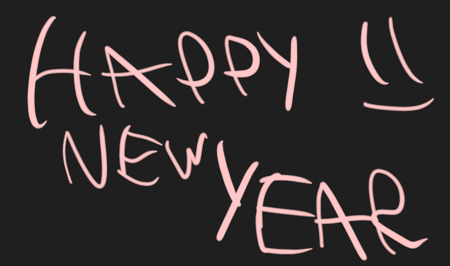
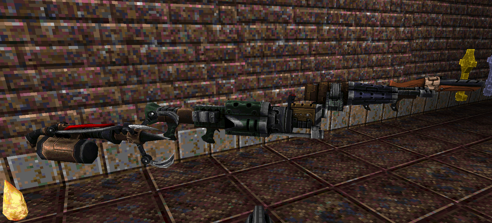

  ## [[Downloads/Releases]](https://github.com/MissLavender-LQ/LibreQuake/releases)
  # LibreQuake

The *LibreQuake* project aims to create a complete, free content first-person shooter game, but *LibreQuake* by itself is just the raw material for a game. It must be paired with a compatible engine to be played.

There is a massive [back catalogue](https://www.quaddicted.com), spanning over two decades, containing thousands of *Quake* levels and other modifications (“mods”) made by fans of the game. *LibreQuake* aims to be compatible with these and allows most to be played without the need to use non-free software.

The engine uses a directory called `id1/`, within that directory there are two archives called `pak0.pak` and `pak1.pak`, these archives contain all the game data except the soundtrack. While the *Quake* engine source code is free, you would usually still need one of the proprietary data files from [id Software](http://www.idsoftware.com) to play *Quake*. *LibreQuake* aims to create a free alternative: combined with the GPL-licensed *Quake* source code, this results in a completely free game.

### LibreQuakes Website [librequake.queer.sh](https://librequake.queer.sh).

# How to Play

Since *LibreQuake* is only the game data, you will still need to download an engine. These are also often termed “source ports” by the community. There are an overwhelming number of choices available, a lengthy list of which is available on the [Quake Wiki](https://quakewiki.org/wiki/Engines).

One particularly recommended by the *LibreQuake* project is [QuakeSpasmSpiked](https://triptohell.info/moodles/qss). This engine offers good support for single-player and the majority of mods created for both *Quake* and *LibreQuake*. As of April 2020, there are no PAK packaged files, but the work in progress can be played by placing the `lq1` directory in the main directory of your engine, the same place as the original `id1` folder. Then start your engine with the command line option `+game lq1` just like any other mod. You can then start a new game or use the `map` command from the console to explore in progress maps.

# What “Free” Means

When we speak of free content or software, we refer to the movement in which your freedom to use, copy, modify, and study a work is not infringed. For example, you may freely use *LibreQuake* for any purpose you see fit, you may redistribute it to anyone without needing to ask for permission, you may modify it (provided you keep the license intact, see `COPYING`), and you may study it. You may read more about free software at the [GNU](http://www.gnu.org/) and [Free Software Foundation](http://www.fsf.org) websites.

# Contributing to LibreQuake

Contributions to *LibreQuake* are always welcome, however, there are a few guidelines that should be followed:

## Intellectual property

We know people hate legalese, but this is important. This applies to **everything** which is submitted.

You must be careful when basing on existing graphics or sounds. Most *Quake* projects are lax on reusing intellectual property. There are many mods which contain modified *Quake* models, for example. However, due to the nature of this project, we do not have the same liberty to rip as we please.

The general rules go as follows:

  1. You must have permission for everything you submit. If you make your own resources, do not base them on resources from *Quake* or any other restricted work. If you take work from other places, please make sure that the work is freely-licensed or that you obtain permission to include it in the *LibreQuake* project. They may not place additional restrictions compared to the normal *LibreQuake* license.

  2. Do not try to emulate *Quake* resources exactly. Where possible, put effort to make new versions look visibly different from *Quake*. This is a tough call because our compatibility with *Quake* mods limits how far we can deviate, but it is feasible.

  3. Be especially careful of “free textures” (or “free sounds” or “free graphics”) sites.  Although these would appear at first to be okay to use, many are free for “non-commercial use only.” One of the things we want to be able to do is put this in GNU/Linux distributions (which can be sold or developed commercially).

## Levels

Not all levels for *LibreQuake* must be vanilla-compatible Winquake/vanilla-compatible levels will have their own episode

It is sensible to also heed the following guidelines:

  1. Make sure that skill levels are implemented, and that all multiplayer start points, both cooperative and deathmatch, are present.

  2. Try to make levels appropriately difficult for their position within the progression of the game.  Also bear in mind that not all players may be as skilled a player as you.

  3. While unrestricted by limits, do not make excessively complicated scenes. It is desirable that *LibreQuake* levels should be playable on low-powered hardware, such as phones and old computers.

## Submitting your work

The most common, and a fairly simple method, to submit your work is by posting it on the [LQ Discord](https://discord.gg/Sb43BccfN9) ~~[LQ Matrix](https://github.com/MissLavender-LQ/LibreQuake/).~~

This allows a quick cycle of development and feedback.

An alternative to using the forum is to post your submission on the [issue tracker](https://github.com/MissLav/LibreQuake/issues), which may also be peer-reviewed and provide a feedback cycle.

Unfortunately, the LibreQuake project cannot provide hosting space in the form of a webpage nor FTP, however, there are many free file hosts to use when you need a location to upload files. Sites and services such as [Dropbox](https://www.dropbox.com/) and [Mega](https://mega.co.nz/), as well as others, are common and should be simple to use.

### Crediting information

*LibreQuake* is made up of submissions from many people all over the globe. All of them, including **you**, deserve credit! Please do not forget to provide your name and email when submitting resources.

### Using Git

You can also commit on a clone of the *LibreQuake* repository, although this is a technical task and it is okay to let other *LibreQuake* maintainers to do it instead: that is our normal mode of operation. However, pull requests are much appreciated and you may submit them in any manner you wish, with GitHub’s direct pull requests being the simplest, but by far not the only means.

*LibreQuake* uses the commit message style commonly seen in distributed version control systems, adopted by projects such as Linux and Git. For an explanation of this style, see [How to Write a Git Commit Message](https://chris.beams.io/posts/git-commit/).
